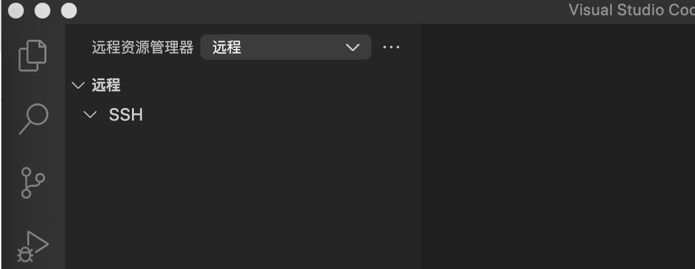
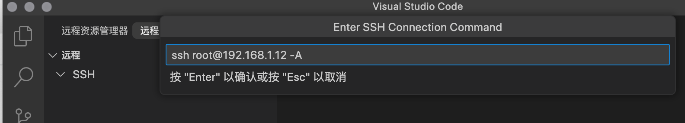
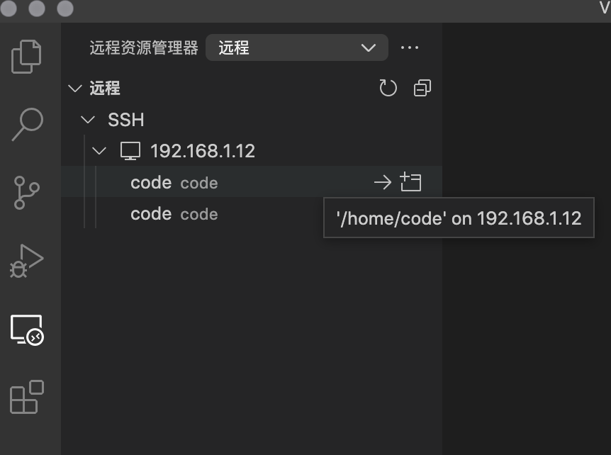
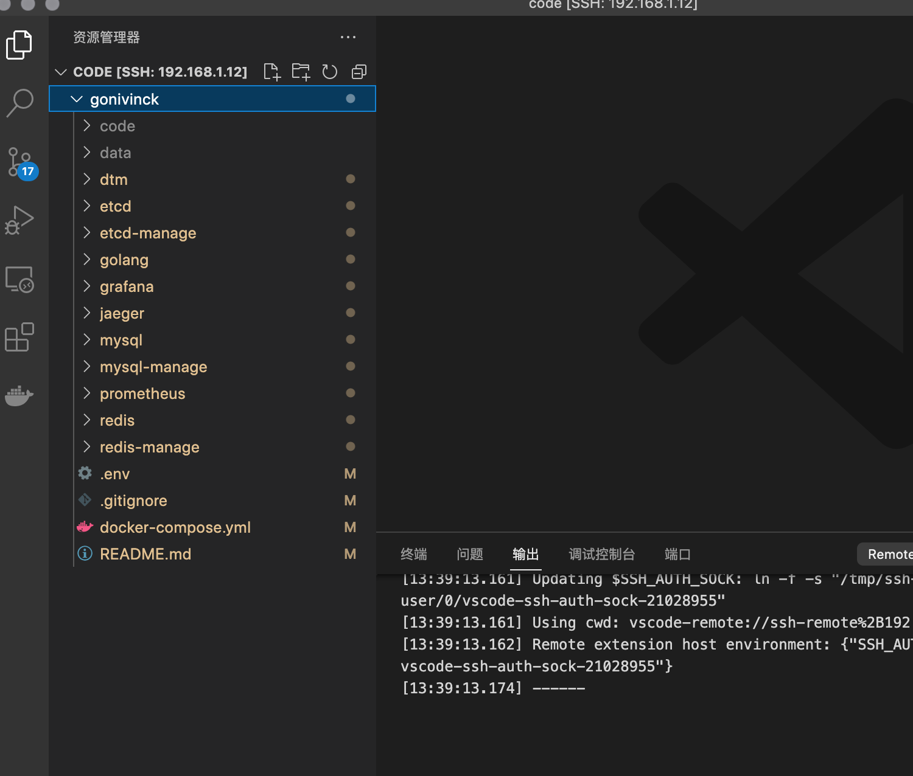
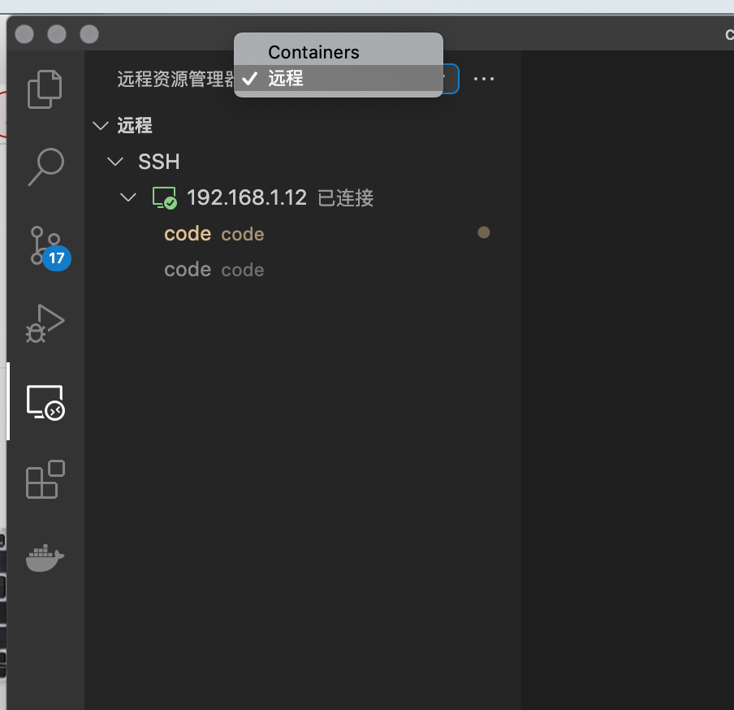
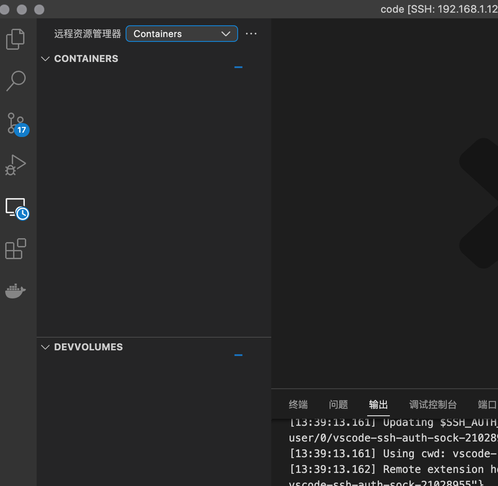
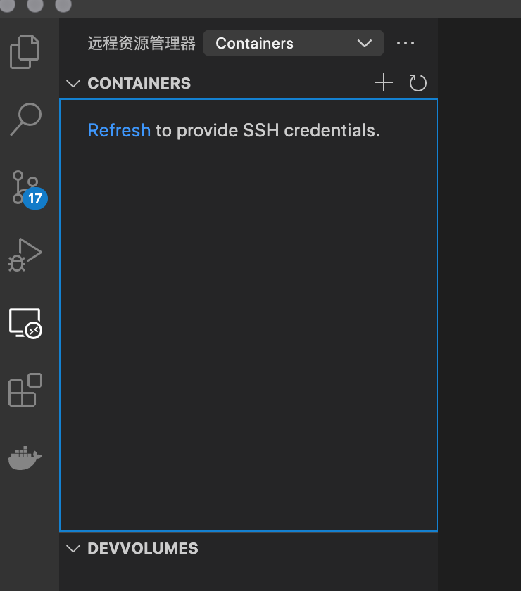
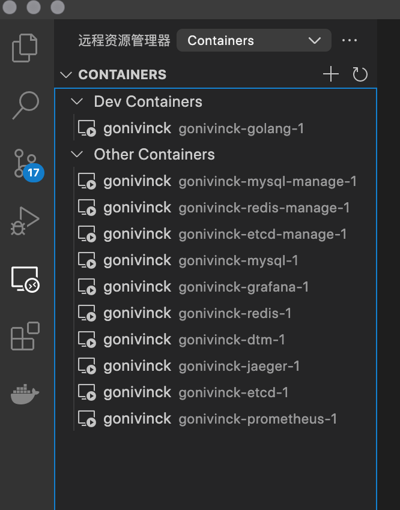
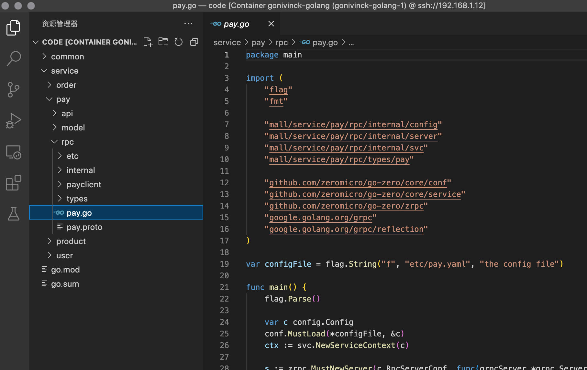

# GolangProjectLearning

> 个人使用go开发学习的记录

## 目录
> 开发环境配置

[go本地开发环境搭建（了解开发环境搭建）](#go本地开发环境搭建) 
[go-zero单体服务+antd开发后台（环境搭建）](doc/go-zero-antd.md)
+ [Ubuntu环境搭建](doc/go-zero-antd.md#环境搭建) 
+ [Vscode 远程连接设置](#vscode-远程连接设置) 
+ [安装Docker](doc/go-zero-antd.md#安装docker) 
+ [安装docke-compose](doc/go-zero-antd.md#安装docker-compose) 
+ [服务器提交github配置（选看）](doc/go-zero-antd.md#github-ssh配置) 
+ [编写Dockerfile](doc/go-zero-antd.md#编写dockerfile) 
+ [配置golang环境](doc/go-zero-antd.md#配置golang环境) 
+ [安装nodejs](doc/go-zero-antd.md#安装nodejs)
+ [go-zero环境配置](doc/go-zero-antd.md#go-zero环境配置) 
+ [接口demo开发](doc/go-zero-antd.md#tapi-接口开发) 
+ [antdpro demo](doc/go-zero-antd.md#antd-pro-demo)

> 实战开发

[后台开发实战-2](doc/go-zero-antd2.md#后台开发实战-2)

## go本地开发环境搭建

> 使用vbox + Ubuntu虚拟机 + docker + docker-compose + vscode远程容器内开发golang

+ 1. vbox安装（自行安装）
+ 2. 使用vbox安装Ubuntu（自行安装）
+ 3. 在Ubuntu中安装docker和docker-compose （自行安装）
+ 4. vscode远程容器内开发golang

### 首先启动docker-compose
    
[goivinck](https://github.com/nivin-studio/gonivinck) 这个是基于go-zero的一个开发环境

### vscode需要安装两个插件

Remote - SSH (这个可以通过ssh远程连接服务器)

Remote Development （这个可以等远程连接完服务器再连接容器）

打开 Remote - SSH 可以看到这个界面，然后新建连接

输入 ssh root@192.168.1.12 -A   -A一定要加不然有问题

进去之后选择打开目录，我这边是已经弄好的，就直接选择一个目录进去即可

这个就是虚拟机中Ubuntu中之前需要使用到的docker-compose的一个目录，记得docker-compose up启动

进入目录之后需要安装好 Remote Development 这个和Remote SSH同一个选项按钮打开后有一个远端资源管理器选择Containers。

这个进去之后会很慢，应该是vscode在配置一些远端资源，实在太慢就关闭重新进入一遍即可

看到这个页面点击Refresh，弹出框输入服务器密码即可（这个页面出来慢，需要多次尝试，暂时没搞清楚原因）

这个已经是远端服务器docker运行的Containers列表了，选择golang的那个进入

至此已经可以编写代码执行go程序了。这个进来之后vscode会让你安装go tools一些插件选择安装即可。

> 这种开发环境对于我来说好处就是不管我是用Windows还是mac来开发都可以使用。这种开发环境配置算是复杂的，如果个人只是单纯需要golang的环境，我建议直接配置好虚拟机之后直接在虚拟机中配置go环境，然后用vscode远程开发即可。看个人喜好。

> 开发环境我个人比较喜欢本地使用虚拟机安装linux之后共享目录，这样代码可以本地编写，运行环境在虚拟机中。这样可以保证我们开发环境尽量贴合生产环境，现在vscode提供了Remote SSH这个插件很好用，我不需要再搞共享目录了，再配合docker可以快速创建统一的开发环境，随时切换都可以。

> 学会了这种开发模式后在允许的情况下可以直接调试线上代码

[go-zero单体服务+antd开发后台](doc/go-zero-antd.md)
一个完整的go+antd的开发学习实战