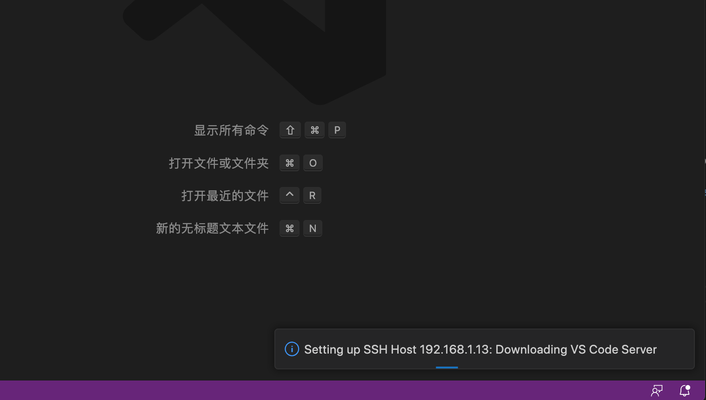
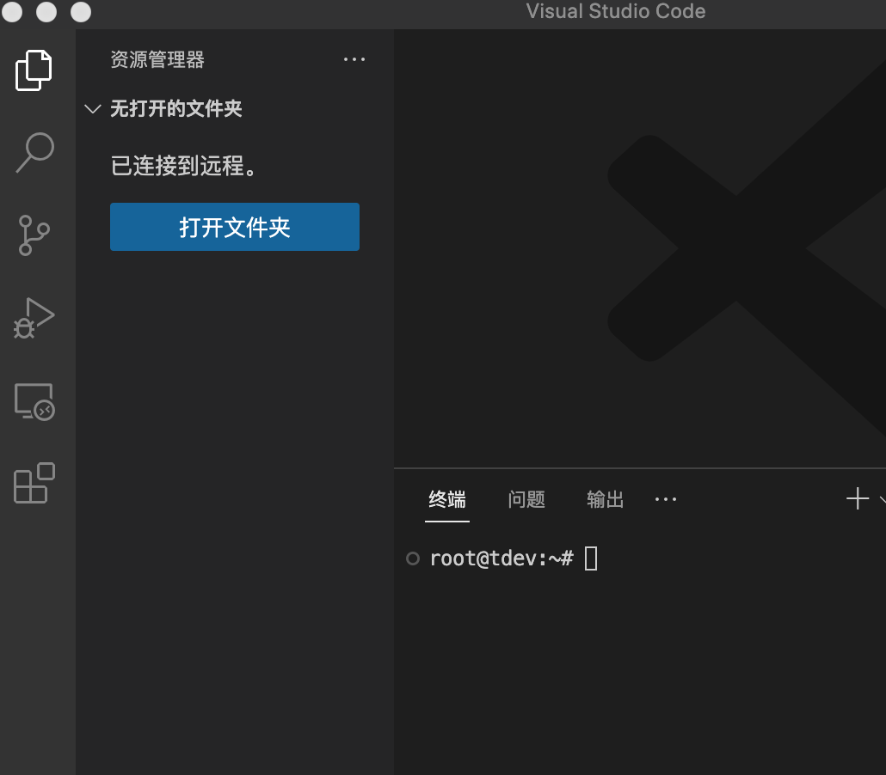
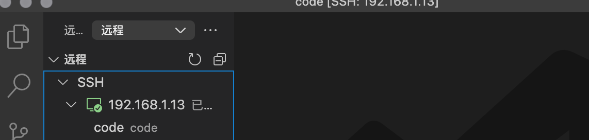
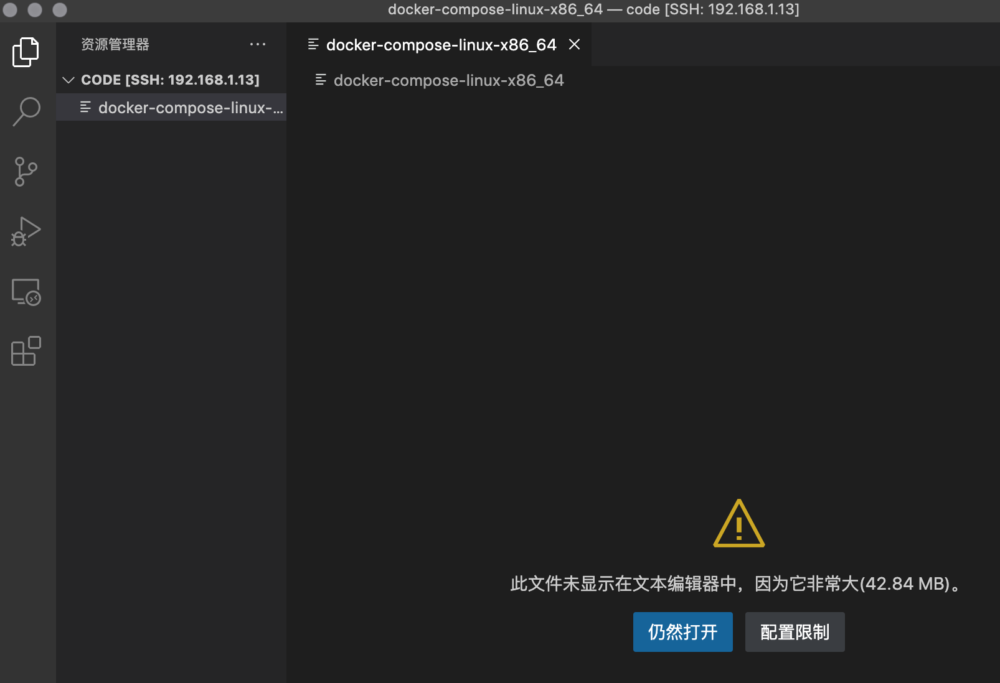
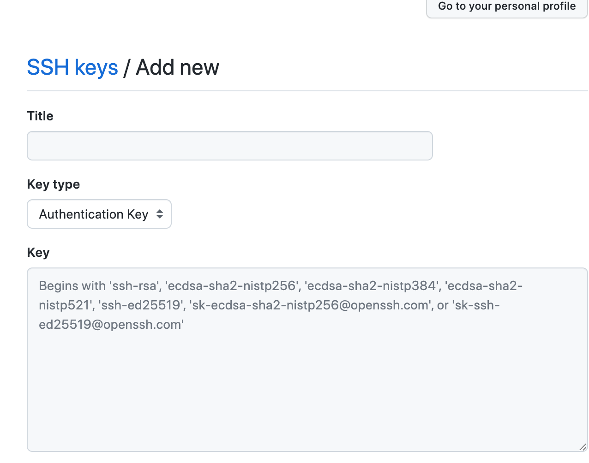
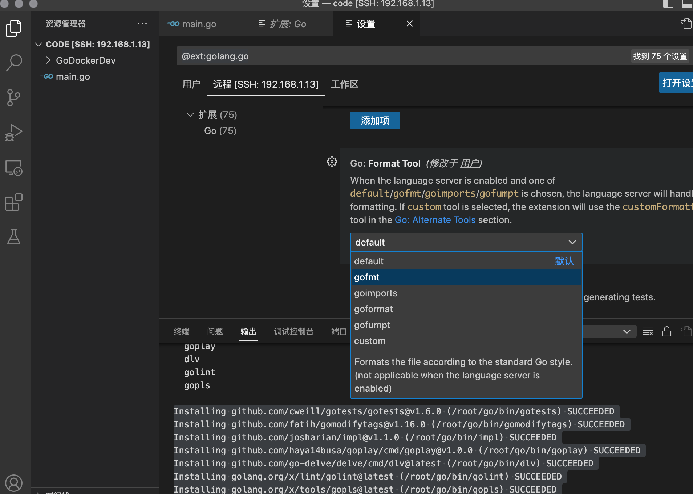

# 后台开发实战

## 目录
============ 环境配置===============<br />
[Ubuntu环境搭建](#环境搭建)<br />
[Vscode 远程连接设置](#vscode-远程连接设置)<br />
[安装Docker](#安装docker)<br />
[安装docke-compose](#安装docker-compose)<br />
[服务器提交github配置（选看）](#github-ssh配置)<br />
[编写Dockerfile](#编写dockerfile)<br />
[配置golang环境](#配置golang环境)<br />

> 目的完成一个包含前后端的项目，从环境安装，配置项目，编写代码，调试项目等

## Ubuntu环境搭建

> 安装版本 ubuntu-22.04.1-live-server-amd64.iso

1. 安装Ubuntu虚拟机

    选择minimize最小化安装，其他后续再安装

    内存使用4096Mb，磁盘100G

2. 允许root ssh登录

    这个涉及到vscode远端开发的时候，如果不是root会非常麻烦

    ```
    // 先设置root密码
    sudo passwd

    // 切换到root
    su

    // 编辑
    vi /etc/ssh/sshd_config

    // 找到PermitRootLogin without-password 修改为PermitRootLogin yes

    // 重启sshd
    service ssh restart
    ```    
    


3. 配置服务器
    
    修改静态ip

    ```
    vim /etc/netplan/00-installer-config.yaml

    ```

    修改为
    ```
    # This is the network config written by 'subiquity'
    network:
    ethernets:
        enp0s3:
        dhcp4: false
        addresses: [192.168.1.13/24]
        optional: true
        routes:
            - to: default
            via: 192.168.1.1
        nameservers:
            addresses: [192.168.1.1]
    version: 2
    ```
    应用配置
    ```
    netplan apply
    ```
Ubuntu基础环境安装配置完成

## Vscode 远程连接设置

1. 新建远程连接，弹出框中输入
    ```
    ssh root@192.168.1.13 -A
    ```
    回车后记得刷新一下列表

2. 进入之后会自动安装配置vscode远端环境
    
    然后显示
    

3. 进入远端后终端自动连接到远端服务可以直接执行命令
    ```
    // 创建一个开发目录
    mkdir /home/code
    ```

4. 点击打开文件夹，打开刚刚创建的目录

    
    在SSH列表中就有刚刚连接的目录了，下次直接点击连接。

## 安装Docker

官方 apt 源中就有 Docker，我们可以直接通过 apt 来安装(其他版本的自行研究)

```
sudo apt update
sudo apt install docker.io

// 安装完查看
root@tdev:~# docker ps 
CONTAINER ID   IMAGE     COMMAND   CREATED   STATUS    PORTS     NAMES
root@tdev:~# docker -v
Docker version 20.10.12, build 20.10.12-0ubuntu4
```

配置docker国内镜像源

增加Docker的镜像源配置文件 /etc/docker/daemon.json，如果没有配置过镜像该文件默认是不存的，在其中增加如下内容：
```
{       
    "registry-mirrors": ["http://hub-mirror.c.163.com"]
}
```

```
// 重启docker服务
service docker restart

// 查看镜像
root@tdev:~# docker info|grep Mirrors -A 1
 Registry Mirrors:
  http://hub-mirror.c.163.com/
```

## 安装docker-compose

1. 通过github下载 docker-compose-linux-x86_64 

    网上有很多通过命令下载，不过有时候下载不下来，直接下载然后通过vscode直接拖拽进服务器。
    

    ```
    mv docker-compose-linux-x86_64 /usr/local/bin/docker-compose

    sudo chmod +x /usr/local/bin/docker-compose

    // 检查是否安装完成

    root@tdev:/home/code# docker-compose 

    Usage:  docker compose [OPTIONS] COMMAND

    Docker Compose

    Options:
        --ansi string                Control when to print ANSI control
                                    characters ("never"|"always"|"auto")
                                    (default "auto")

    ....
    ```


## github ssh配置

 为了服务器上传代码等资料到github上，开发的话可以参照这个发送代码上传gitlab公司库等   
```
// 创建一个新的秘钥，在/root/.ssh
ssh-keygen -t rsa -b 4096 -C "your_email@example.com"

// 生成后
-rw------- 1 root root 3381 Feb 10 10:48 id_rsa
-rw-r--r-- 1 root root  744 Feb 10 10:48 id_rsa.pub
```
 去github新建ssh key，把id_rsa.pub中的内容复制到
 

 ```
    Omit --global to set the identity only in this repository.

    fatal: no email was given and auto-detection is disabled
    2023-02-10 11:01:47.060 [info] > git config --get-all user.name [2ms]
    2023-02-10 11:01:47.070 [info] > git config --get commit.template [6ms]
    2023-02-10 11:01:47.072 [info] > git for-each-ref --format=%(refname)%00%(upstream:short)%00%(objectname)%00%(upstream:track)%00%(upstream:remotename)%00%(upstream:remoteref) refs/heads/main refs/remotes/main [3ms]
    2023-02-10 11:01:47.083 [info] > git status -z -uall [8ms]
    2023-02-10 11:01:47.090 [info] > git for-each-ref --sort -committerdate --format %(refname) %(objectname) %(*objectname) [7ms]
 ```
git 提交报错，主要是添加username和email
```
git config --global user.name "xxxxx"
git config --global user.email "xxxx@126.com"
```
这样就可以使用vscode提交代码到github（现在这个是全局，多个git仓库我暂时没有配置过，这个项目暂时先这么处理，如果需要多个ssh key设置自行研究吧）

## 编写Dockerfile

我单独创建了一个项目把dockerfile放在里面了 [地址](https://github.com/timzzx/GoDockerDev)

### Mysql Dockerfile
```
FROM mysql:5.7

LABEL maintainer="tim"
```

### Redis Dockerfile
```
FROM redis:5.0

LABEL maintainer="tim"
```

### docker-compose.yml
```
version: '1.0'
# 网络配置
networks:
  backend:
    driver: ${NETWORKS_DRIVER}

# 服务容器配置
services:
  mysql:
    build:
      context: ./mysql
    environment:
      - TZ=${TZ}
      - MYSQL_USER=${MYSQL_USERNAME}                  # 设置 Mysql 用户名称
      - MYSQL_PASSWORD=${MYSQL_PASSWORD}              # 设置 Mysql 用户密码
      - MYSQL_ROOT_PASSWORD=${MYSQL_ROOT_PASSWORD}    # 设置 Mysql root 用户密码
    privileged: true
    volumes:
      - ${DATA_PATH_HOST}/mysql:/var/lib/mysql        # 引用 .env 配置中 DATA_PATH_HOST 变量，将宿主机上存放 Mysql 数据的目录挂载到容器中 /var/lib/mysql 目录
    ports:
      - "${MYSQL_PORT}:3306"                          # 设置容器3306端口映射指定宿主机端口
    networks:
      - backend
    restart: always

  redis:
    build:
      context: ./redis
    environment:
      - TZ=${TZ}
    privileged: true
    volumes:
      - ${DATA_PATH_HOST}/redis:/data                 # 引用 .env 配置中 DATA_PATH_HOST 变量，将宿主机上存放 Redis 数据的目录挂载到容器中 /data 目录
    ports:
      - "${REDIS_PORT}:6379"                          # 设置容器6379端口映射指定宿主机端口
    networks:
      - backend
    restart: always
```

### .env
```
# 设置时区
TZ=Asia/Shanghai
# 设置网络模式
NETWORKS_DRIVER=bridge

# 宿主机上Mysql Reids数据存放的目录路径
DATA_PATH_HOST=./data

# Mysql 服务映射宿主机端口号，可在宿主机127.0.0.1:3306访问
MYSQL_PORT=3306
MYSQL_USERNAME=admin
MYSQL_PASSWORD=123456
MYSQL_ROOT_PASSWORD=123456

# Redis 服务映射宿主机端口号，可在宿主机127.0.0.1:6379访问
REDIS_PORT=6379
```

项目目录
```
.
├── LICENSE
├── README.md
├── docker-compose.yml
├── mysql
│   └── Dockerfile
└── redis
    └── Dockerfile
```

启动
``` 
docker-compose up -d
```

测试mysql redis 连接成功

停止
```
docker-compose stop
```

删除
```
docker-compose rm
```
只要data目录不删除数据就会保留

## 配置golang环境

> 之前配置过在docker golang容器中开发，虽然可行，但是配置复杂并且连接很慢，所以直接在虚拟机配置golang开发环境

安装
```
rm -rf /usr/local/go && tar -C /usr/local -xzf go1.19.1.linux-amd64.tar.gz

// 在/etc/profile最后添加
export PATH=$PATH:/usr/local/go/bin
export GOPROXY=https://goproxy.cn

// 然后profile生效
source /etc/profile

// 查看是否安装成功
root@tdev:/home/tim# go version
go version go1.19.1 linux/amd64

```

### vscode 配置远端golang

在远端安装golang扩展


安装完会自动跳出安装go tools 点击安装就可以了

```
Installing github.com/cweill/gotests/gotests@v1.6.0 (/root/go/bin/gotests) SUCCEEDED
Installing github.com/fatih/gomodifytags@v1.16.0 (/root/go/bin/gomodifytags) SUCCEEDED
Installing github.com/josharian/impl@v1.1.0 (/root/go/bin/impl) SUCCEEDED
Installing github.com/haya14busa/goplay/cmd/goplay@v1.0.0 (/root/go/bin/goplay) SUCCEEDED
Installing github.com/go-delve/delve/cmd/dlv@latest (/root/go/bin/dlv) SUCCEEDED
Installing golang.org/x/lint/golint@latest (/root/go/bin/golint) SUCCEEDED
Installing golang.org/x/tools/gopls@latest (/root/go/bin/gopls) SUCCEEDED

All tools successfully installed. You are ready to Go. :)
```
修改一下gofmt不然格式化会有问题



至此 golang远端配置完成