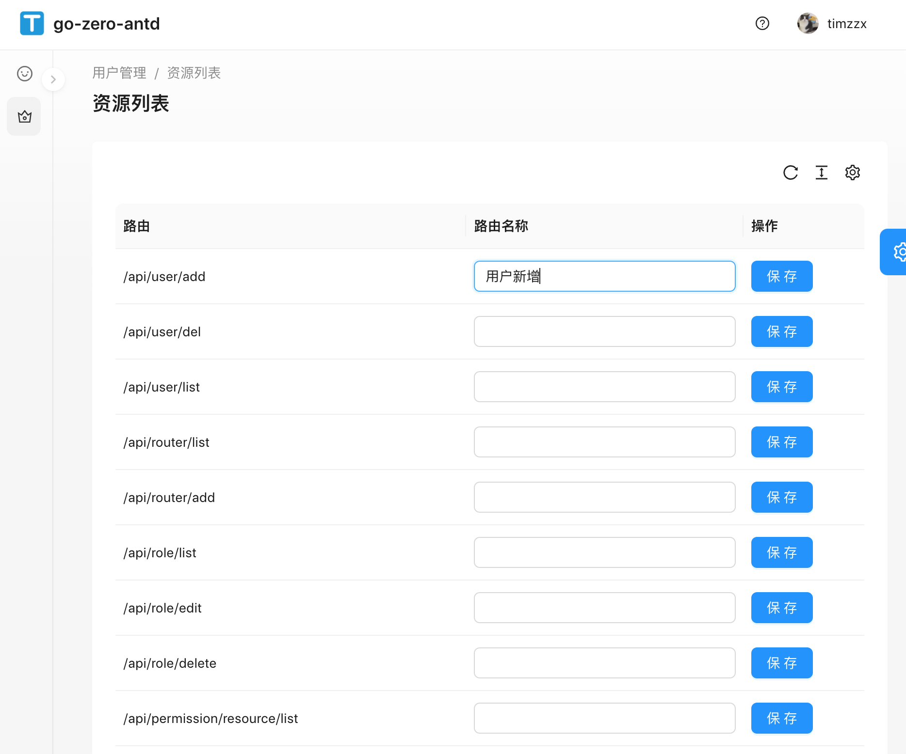

# go-zero-antd实战-10（资源发布antd，protable编辑单行提交，没有使用editTable）

## 前言
> 阅读本文档之前先阅读之前的[文档](https://github.com/timzzx/GolangProjectLearning),本文档的[源码地址](https://github.com/timzzx/go-zero-antd-backend)

> 这个功能主要是为了按照go-zero的路由作为权限资源发布，只展示antd部分，接口部分请查看源码

## 新增services request

修改 web/src/services/tapi/typings.d.ts

``` ts
...
// 路由列表
type Router = {
    method?: string;
    path?: string;
    name?: string;
}
type RouterListResponse = {
    code?: number;
    msg?: string;
    data?: Router[];
}

// 权限资源新增
type RouterAddParam = {
    name?: string;
    path?: string;
}
type RouterAddResponse = {
    code?: number;
    msg?: string;
}
...
```
修改 web/src/services/tapi/api.ts
```ts
···
// 路由列表
export async function routerList() {
    return request<TAPI.RouterListResponse>("/api/router/list", {
        method: "GET",
    })
}

// 新增权限
export async function routerAdd(data: TAPI.RouterAddParam) {
    return request<TAPI.RouterAddResponse>("/api/router/add", {
        method: "POST",
        data: data,
    })
}
```

## 新增components

> umi g page PermissonResourceList --dir

## 增加路由配置
修改web/config/routes.ts
```ts
{
    path: '/user/permission/resource/list',
    name: '资源列表',
    component: './PermissonResourceList',
},
```
这里说明一下，该路由是放在user路由下的，所以必须在前面加上/user/ 

## 编写页面

> 这里没有使用edittable，edittable太复杂了，这里只需要获取到当行的数据进行保存，保存完刷新即可。

修改 web/src/pages/PermissonResourceList/index.tsx

```ts
import { PageContainer, ProTable, ProColumns } from '@ant-design/pro-components';
import React from 'react';
import { Input, Button, message } from 'antd';
import { routerList, routerAdd } from '@/services/tapi/api';
import { history } from '@umijs/max';

const Index: React.FC = () => {

  const handleSave = async (data: any) => {
    const d = await routerAdd(data);
    message.info(d.msg);
    history.go(0);
  }

  const columns: ProColumns[] = [
    {
      title: "路由",
      dataIndex: "path",
    },
    {
      title: "路由名称",
      dataIndex: "name",
      // 这个是新加的不存在record中，为了提交时候能够获取到inout填写的Name， 直接赋值record.name = e.target.value;
      render: (_, record) => [
        <Input key="routername" name="name" onChange={(e) => {
          record.name = e.target.value;
        }} />
      ]
    },
    {
      title: "操作",
      render: (text, record) => [
        // 这里就能获取到上面存入的record.name
        <Button key="2" type="primary" onClick={() => { handleSave(record) }}>保存</Button>,
      ]
    },
  ];
  return (
    <PageContainer>
      <ProTable
        rowKey={record => record.path || ""}
        search={false}
        columns={columns}
        request={async (params) => {
          console.log(params);
          const d = await routerList()
          return Promise.resolve({
            data: d.data,
            success: true,
          });
        }}
      ></ProTable>
    </PageContainer>
  );
}

export default Index;
```

## 页面展示
