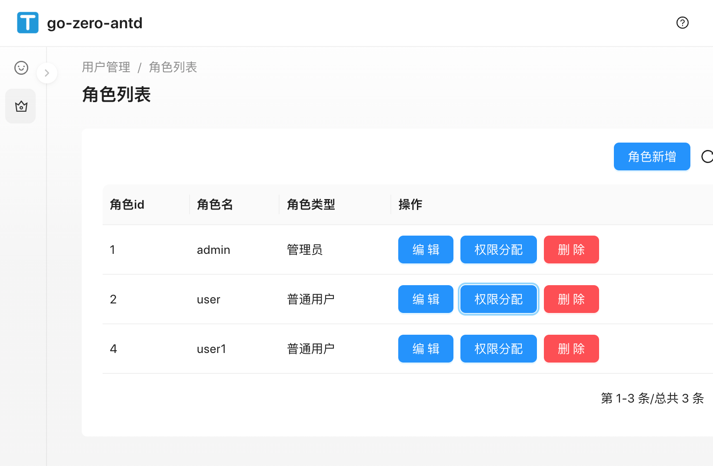
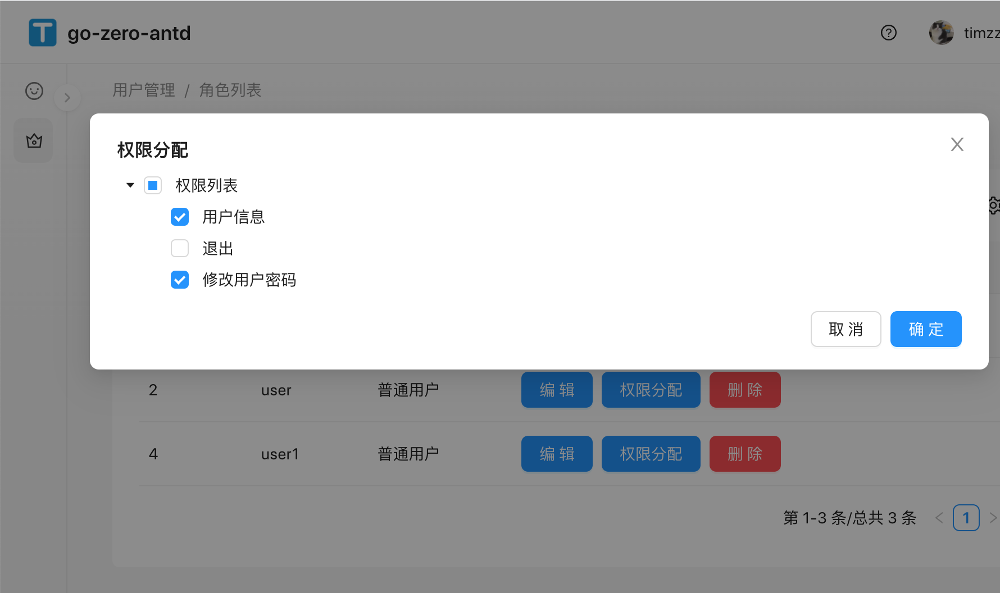

# go-zero-antd实战-11(antd用户角色分配权限，antd tree控件，hooks使用)【前后端权限管理完结】

## 前言
> 阅读本文档之前先阅读之前的[文档](https://github.com/timzzx/GolangProjectLearning),本文档的[源码地址](https://github.com/timzzx/go-zero-antd-backend)

> 这个功能主要是为了按照go-zero的路由作为权限资源发布，只展示antd部分，接口部分请查看源码

## 新增services request
修改web/src/services/tapi/typings.d.ts
```ts
// 角色编辑
type RoleEditRequest = {
    id?: number;
    name?: string;
    type?: number;
}
type RoleEditResponse = {
    code?: number;
    msg?: string;
}
type RoleDelRequest = {
    id?: number;
}
type RoleDelResponse = {
    code?: number;
    msg?: string;
}

// 角色的资源列表
type RolePermissionListParam = {
    role_id?: number;
}
type RolePermission = {
    id?: number;
    name?: string;
}
type RolePermissionListResponse = {
    code?: number;
    msg?: string;
    data?: RolePermission[];
    checkdata?: RolePermission[];
}
// 分配角色资源
type rolePermissionEditParam = {
    role_id?: number;
    data?: string;
}
type rolePermissionEditResponse = {
    code?: number;
    msg?: string;
}
```
修改/home/code/go-zero-antd-backend/web/src/services/tapi/api.ts

```ts
// 角色编辑
export async function roleEdit(params: TAPI.RoleEditRequest) {
    return request<TAPI.RoleEditResponse>("/api/role/edit", {
        method: "POST",
        params: params,
    })
}

// 角色删除
export async function roleDel(params: TAPI.RoleDelRequest) {
    return request<TAPI.RoleDelResponse>("/api/role/delete", {
        method: "POST",
        params: params,
    })
}

// 角色权限列表
export async function rolePermissionList(params: TAPI.RolePermissionListParam) {
    return request<TAPI.RolePermissionListResponse>("/api/role/permission/resource/list", {
        method: "POST",
        params: params,
    })
}
// 角色权限分配
export async function rolePermissionEdit(params: TAPI.rolePermissionEditParam) {
    return request<TAPI.rolePermissionEditResponse>("/api/role/permission/resource/edit", {
        method: "POST",
        params: params,
    })
}

```

## 新增components

> umi g page RoleList --dir

## 增加路由配置
修改web/config/routes.ts
```ts
{
    path: '/user/role/list',
    name: '角色列表',
    component: './RoleList',
},
```

## 编写页面

> 这个功能带有tree控件和使用了useState和useAsyncEffect（ahooks的可以接收异步数据）

```ts
import { ModalForm, PageContainer, ProColumns, ProTable, ProFormText, ProFormSelect } from '@ant-design/pro-components';
import React, { useState } from 'react';
import { Button, message, Popconfirm, Space, Tree } from 'antd';
import { useAsyncEffect } from 'ahooks';
import type { DataNode, TreeProps } from 'antd/es/tree';
import type { Key } from 'rc-tree/lib/interface';
import { roleList, roleEdit, roleDel, rolePermissionList, rolePermissionEdit } from '@/services/tapi/api';


const RoleEdit: React.FC<TAPI.Role & { title?: string }> = (props) => {

  const { title } = props;

  return (
    <ModalForm
      title={title}
      trigger={<Button type="primary">{title}</Button>}
      onFinish={async (param) => {
        const data = await roleEdit(param);
        message.info(data.msg)
        if (data.code !== 200) {
          return false;
        }
        history.go(0);
        return true;
      }}
    >
      <ProFormText
        name="id"
        hidden={true}
        initialValue={props.id || 0}
      />
      <ProFormText
        name="name"
        label="角色名"
        initialValue={props.name || ""}
        required={true}
        rules={[
          {
            required: true,
          },
        ]}
      />
      <ProFormSelect
        name="type"
        label="角色类型"
        options={[
          {
            value: 1,
            label: "普通角色"
          },
          {
            value: 2,
            label: "管理员角色",
          },
        ]}
        initialValue={props.type || 1}
      />
    </ModalForm>
  );
}

// 权限分配
const PermissionsAssigned: React.FC<TAPI.RolePermissionListParam> = (props) => {

  const { role_id } = props;

  // tree数据
  const [data, setData] = useState<DataNode[]>()
  // tree默认选中数据
  const [defaultData, setDefaultData] = useState<Key[]>()
  // 勾选中数据
  const [ids, setIds] = useState<string>("");

  // 格式化数据符合tree数据
  const handleFormatTree = (data: TAPI.RolePermissionListResponse) => {
    let childs: DataNode[] = [];

    const list = data.data;
    if (list?.length !== undefined) {
      const len = list.length;
      for (let i = 0; i < len; i++) {
        let children: DataNode;
        children = {
          title: list[i].name,
          key: list[i].id || -1,
        }
        childs.push(children)

      }
    }

    let treeList: DataNode[] = [
      {
        title: '权限列表',
        key: -1,
        children: childs,
      },
    ];
    setData(treeList);

    const checkData: TAPI.RolePermission[] = data.checkdata as TAPI.RolePermission[];

    let checkedData: Key[] = [];
    for (let i = 0; i < checkData?.length || 0; i++) {
      checkedData.push(checkData[i].id || -1);
    }
    setDefaultData(checkedData)
  }

  // effect
  useAsyncEffect(async () => {
    const d = await rolePermissionList({ "role_id": role_id });
    handleFormatTree(d);
  }, [])


  const onCheck: TreeProps['onCheck'] = (checkedKeys) => {

    const keys = checkedKeys as Array<number | string>;
    const str = keys.join(",");
    setIds(str);
  }

  return (
    <ModalForm
      title="权限分配"
      trigger={<Button type="primary" >权限分配</Button>}
      onFinish={async () => {
        let d = await rolePermissionEdit({ role_id: role_id, data: ids });
        if (d.code !== 200) {
          message.info(d.msg);
          return false;
        }
        history.go(0);
        return true;
      }}
    >
      <Tree
        checkable
        defaultExpandAll
        defaultCheckedKeys={defaultData}
        treeData={data}
        onCheck={onCheck}
      />
    </ModalForm>
  );
}


const Index: React.FC<TAPI.Role> = () => {

  const handleDel = async (id: number | undefined) => {
    const data = await roleDel({ id: id });
    message.info(data.msg)
    if (data.code === 200) {
      history.go(0);
    }
  }

  const columns: ProColumns<TAPI.Role>[] = [
    {
      title: "角色id",
      dataIndex: "id"
    },
    {
      title: "角色名",
      dataIndex: "name"
    },
    {
      title: "角色类型",
      dataIndex: "type",
      valueEnum: {
        1: { text: "普通用户" },
        2: { text: "管理员" }
      }
    },
    {
      title: "操作",
      render: (_, record) => (
        <Space>
          <RoleEdit key="roleedit" title="编辑" {...record} />
          <PermissionsAssigned role_id={record.id} />
          <Popconfirm
            title="是否删除"
            okText="是"
            onConfirm={() => { handleDel(record.id) }}
            cancelText="否"
          >
            <Button type="primary" danger >删除</Button>
          </Popconfirm>
        </Space>
      ),
    },
  ];


  return (
    <PageContainer>
      <ProTable<TAPI.Role>
        columns={columns}
        search={false}
        rowKey={record => record.id || ""}
        request={async () => {

          const d = await roleList();

          return Promise.resolve({
            data: d.data,
            success: true,
          });
        }}
        toolBarRender={() => [
          <RoleEdit key="roleedit" title="角色新增" />
        ]}
      >
      </ProTable>
    </PageContainer>
  );
}

export default Index;

```

展示

