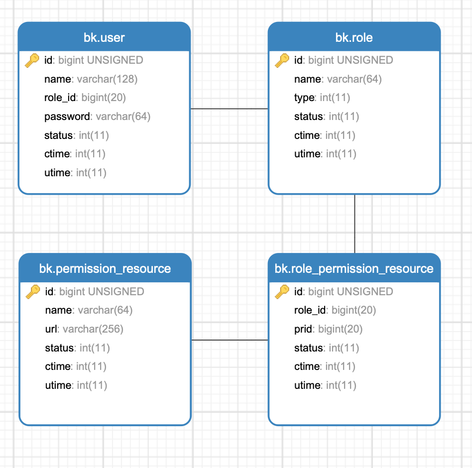

# go-zero单体服务（权限管理）

> 基于tapi项目[文档地址](go-zero-antd2.md#后台开发实战-2)，可以使用casbin做权限管理，为了多练习使用go-zero本文档从零开发权限管理

## 数据库表设计

创建role表
```sql
CREATE TABLE `role` (
  `id` bigint(20) unsigned zerofill NOT NULL AUTO_INCREMENT COMMENT '角色表',
  `name` varchar(64) NOT NULL DEFAULT '' COMMENT '角色名',
  `type` int(11) NOT NULL DEFAULT '1' COMMENT '1.普通用户，2.管理员',
  `status` int(11) NOT NULL DEFAULT '1' COMMENT '1.有效，2.无效',
  `ctime` int(11) NOT NULL DEFAULT '0' COMMENT '创建时间',
  `utime` int(11) NOT NULL DEFAULT '0' COMMENT '更新时间',
  PRIMARY KEY (`id`)
) ENGINE=InnoDB DEFAULT CHARSET=utf8mb4 COMMENT='角色表'
```
权限资源表
```sql
CREATE TABLE `permission_resource` (
  `id` bigint(20) unsigned zerofill NOT NULL AUTO_INCREMENT COMMENT '权限资源表主键',
  `name` varchar(64) NOT NULL DEFAULT '' COMMENT '资源名称',
  `url` varchar(256) NOT NULL DEFAULT '' COMMENT '资源url',
  `status` int(11) NOT NULL DEFAULT '1' COMMENT '1.有效，2.无效',
  `ctime` int(11) NOT NULL DEFAULT '0' COMMENT '创建时间',
  `utime` int(11) NOT NULL DEFAULT '0' COMMENT '更新时间',
  PRIMARY KEY (`id`)
) ENGINE=InnoDB DEFAULT CHARSET=utf8mb4 COMMENT='权限资源表'
```
角色权限资源关联表表
```sql
CREATE TABLE `role_permission_resource` (
  `id` bigint(20) unsigned zerofill NOT NULL AUTO_INCREMENT COMMENT '角色和权限资源关联表主键',
  `role_id` bigint(20) NOT NULL DEFAULT '0' COMMENT '角色id',
  `prid` bigint(20) NOT NULL DEFAULT '0' COMMENT '权限资源id',
  `status` int(11) NOT NULL DEFAULT '1' COMMENT '1.有效，2.无效',
  `ctime` int(11) NOT NULL DEFAULT '0' COMMENT '创建时间',
  `utime` int(11) NOT NULL DEFAULT '0' COMMENT '更新时间',
  PRIMARY KEY (`id`)
) ENGINE=InnoDB DEFAULT CHARSET=utf8mb4 COMMENT='角色和权限资源关联表'
```
用户表增加role_id字段，关联角色表
```sql
CREATE TABLE `user` (
  `id` bigint(20) unsigned zerofill NOT NULL AUTO_INCREMENT COMMENT '用户表主键',
  `name` varchar(128) NOT NULL COMMENT '用户名',
  `role_id` bigint(20) NOT NULL DEFAULT '0' COMMENT '角色id',
  `password` varchar(64) NOT NULL COMMENT '密码',
  `status` int(11) NOT NULL DEFAULT '1' COMMENT '是否有效1.有效 2.无效',
  `ctime` int(11) NOT NULL DEFAULT '0' COMMENT '创建时间',
  `utime` int(11) NOT NULL COMMENT '更新时间',
  PRIMARY KEY (`id`)
) ENGINE=InnoDB DEFAULT CHARSET=utf8mb4 COMMENT='用户表'
```

这个model显示高亮截图不好弄，只能这样