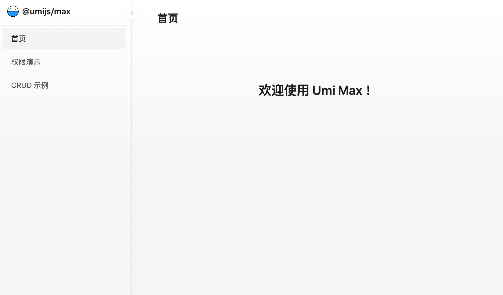
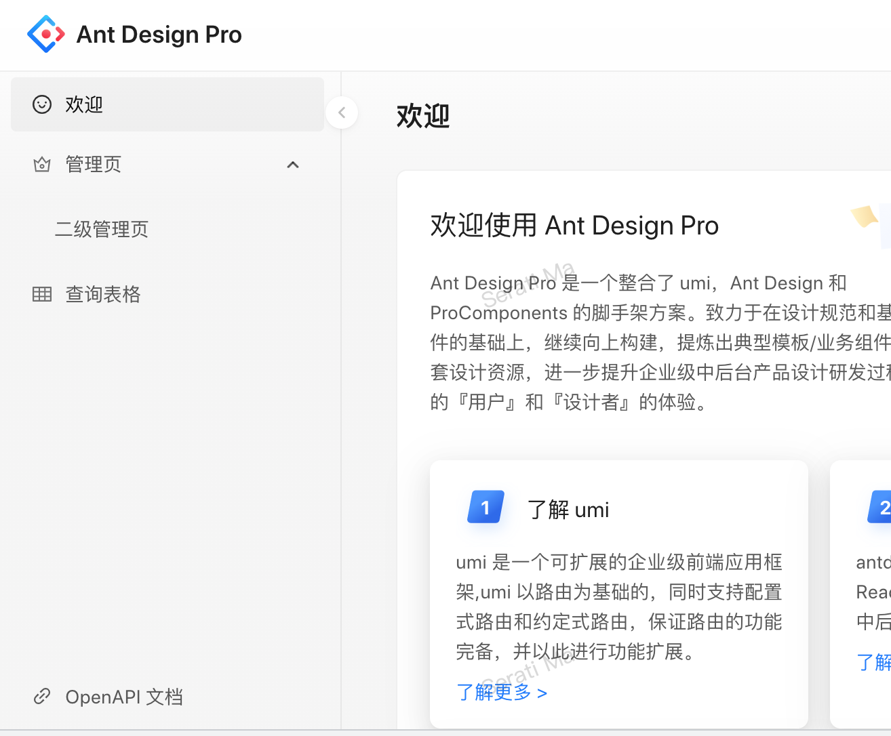
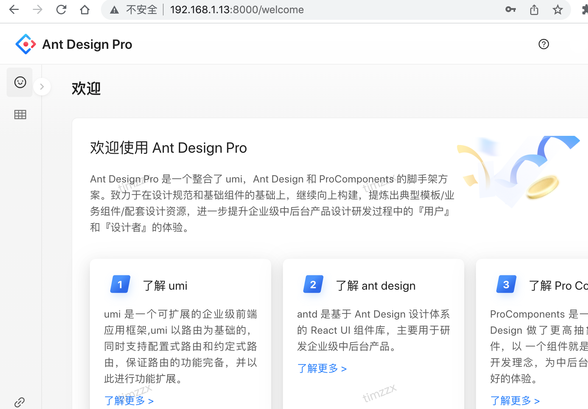

# go-zero-antd后台-前端部分

## 目录

+ [项目创建启动](#项目创建启动)
+ [连接go-zero单体服务接口](#连接go-zero单体服务接口)
+ [统一处理](#统一处理)
+ [运行项目](#运行项目)
+ [antd-pro项目源码](#antd-pro项目源码)


## 项目创建启动

> 需要了解Typescript + React + UMI

> 这次使用的UmiJS v4版本


UmiJS V4 MAX 生成的模板展示


umi max 方法生成的没有登录页面太简单了，改用下面方式创建
```shell
npm i @ant-design/pro-cli -g
pro create antds

? 🐂 使用 umi@4 还是 umi@3 ? (Use arrow keys)
❯ umi@4
  umi@3

// 选择umi@4
```

报错了 No change to package.json was detected. No package manager install will be executed.

查询了[issues](https://github.com/ant-design/ant-design-pro/issues?q=No+change+to+package.json+was+detected.+No+package+manager+install+will+be+executed.)没有回答。暂时不管

```
cd antds
yarn
```
安装完遇到tsconfig无法引入"@@/*": ["./src/.umi/*"],这行报错
解决办法[issues6568](https://github.com/ant-design/ant-design-pro/issues/6568)

上面问题全部解决后
```
// 启动项目
yarn start 
```

// 修改一下登录密码


修改mock/user.ts
```ts
...
'POST /api/login/account': async (req: Request, res: Response) => {
    const { password, username, type } = req.body;
    await waitTime(2000);
    if (password === '123456' && username === 'admin') {
      res.send({
        status: 'ok',
        type,
        currentAuthority: 'admin',
      });
      access = 'admin';
      return;
    }
    if (password === '123456' && username === 'user') {

....
```

用admin 密码123456登录


登录进来了

项目目录
```
├── README.md
├── config
├── jest.config.ts
├── jsconfig.json
├── mock
├── node_modules
├── package.json
├── pnpm-lock.yaml
├── public
├── src
├── tests
├── tsconfig.json
├── types
└── yarn.lock
```

OK项目创建运行成功

## 连接go-zero单体服务接口

> 上面antdpro项目使用的mock的接口，mock如何使用自行学习

打开dev proxy配置修改config/proxy.ts
```ts
dev: {
    // localhost:8000/api/** -> https://preview.pro.ant.design/api/**
    '/api/': {
      // 要代理的地址
      target: 'http://192.168.1.13:8888',
      // 配置了这个可以从 http 代理到 https
      // 依赖 origin 的功能可能需要这个，比如 cookie
      changeOrigin: true,
    },
  },
```

## 统一处理

> 参考ant design pro[统一规范](https://pro.ant.design/zh-CN/docs/request#%E7%BB%9F%E4%B8%80%E8%A7%84%E8%8C%83)

修改 src/requestErrorConfig.ts

```ts
// 与后端约定的响应数据格式
interface ResponseStructure {
  code ?: number;
  msg ?: string;
  data ?: any;
}
```
> 响应的数据格式修改成和后端相同的结构

```ts
// 错误抛出
errorThrower: (res) => {
    const { code, data, msg } =
    res as unknown as ResponseStructure;
    if (code != 200) {
    const error: any = new Error(msg);
    error.name = 'BizError';
    error.info = { code, msg };
    throw error; // 抛出自制的错误
    }
},
```
> HTTP CODE = 200时(这块算业务逻辑错误时)，if (code != 200) 根据code判断请求是否正确，错误的话抛出msg信息

```ts
// 错误接收及处理
    errorHandler: (error: any, opts: any) => {
      if (opts?.skipErrorHandler) throw error;
      // 我们的 errorThrower 抛出的错误。
      if (error.name === 'BizError') {
        const errorInfo: ResponseStructure | undefined = error.info;
        if (errorInfo) {
          const { msg } = errorInfo;
          message.error(msg);
        }
      } else if (error.response) {
        // Axios 的错误
        // 请求成功发出且服务器也响应了状态码，但状态代码超出了 2xx 的范围
        message.error(`Response status:${error.response.status}`);
      } else if (error.request) {
        // 请求已经成功发起，但没有收到响应
        // \`error.request\` 在浏览器中是 XMLHttpRequest 的实例，
        // 而在node.js中是 http.ClientRequest 的实例
        message.error('None response! Please retry.');
      } else {
        // 发送请求时出了点问题
        message.error('Request error, please retry.');
      }
    },
```

> 这里是请求HTTP CODE 不是200时候（请求返回异常），报错处理

```ts
// 请求拦截器
  
  requestInterceptors: [
    (config: RequestOptions) => {
      // console.log(localStorage.getItem('token'));
      let token = localStorage.getItem('token')|| "";
      if (config && config.headers) {
        config.headers["Authorization"] = token;
      }
      // 拦截请求配置，进行个性化处理。
      const url = config?.url?.concat('');
      return { ...config, url };
    },
  ],
```
> 这里是全局请求时，添加Authorization，让每次请求都从localStorage中获取缓存的token，放入header中。

> 这里要注意if (config && config.headers)这一句，不判断会报错，所以要注意

```ts
// 响应拦截器
  responseInterceptors: [
    (response) => {
      // 拦截响应数据，进行个性化处理
      const { data } = response as unknown as ResponseStructure;

      if (data.code != 200) {
        console.log(response);
        message.error('请求失败！');
      }
      return response;
    },
  ],
```
> 每次请求结果判断code，如果不正确就弹出错误信息，后期这里处理权限跳转。

## 处理登录请求

> 阅读src/pages/User/Login/index.tsx

首先找到
```ts
onFinish={async (values) => {
    await handleSubmit(values as API.LoginParams);
}}
```
通过这里找到handleSubmit方法,修改成
```ts
const handleSubmit = async (values: API.LoginParams) => {
    try {
      // 登录
      const response = await login({ ...values });
      if (response.code === 200) {
        // 存入token
        const token = response.token || "";
        localStorage.setItem("token",token)
        const defaultLoginSuccessMessage = intl.formatMessage({
          id: 'pages.login.success',
          defaultMessage: '登录成功！',
        });
        message.success(defaultLoginSuccessMessage);
        await fetchUserInfo();
        const urlParams = new URL(window.location.href).searchParams;
        history.push(urlParams.get('redirect') || '/');
        return;
      }
      console.log(response);
      // 如果失败去设置用户错误信息
      // setUserLoginState(response);
    } catch (error) {
      const defaultLoginFailureMessage = intl.formatMessage({
        id: 'pages.login.failure',
        defaultMessage: '登录失败，请重试！',
      });
      console.log(error);
      message.error(defaultLoginFailureMessage);
    }
  };
```
这里做了登录完成后缓存token操作
```ts
// 存入token
const token = response.token || "";
localStorage.setItem("token",token)
```
这个文件改动比较多就不一一说明了，index.tsx完整修改如下：
```ts
import Footer from '@/components/Footer';
import { login } from '@/services/ant-design-pro/api';
import { useLocalStorageState } from 'ahooks';
import {
  AlipayCircleOutlined,
  LockOutlined,
  MobileOutlined,
  TaobaoCircleOutlined,
  UserOutlined,
  WeiboCircleOutlined,
} from '@ant-design/icons';
import {
  LoginForm,
  ProFormCaptcha,
  ProFormCheckbox,
  ProFormText,
} from '@ant-design/pro-components';
import { useEmotionCss } from '@ant-design/use-emotion-css';
import { FormattedMessage, history, SelectLang, useIntl, useModel, Helmet } from '@umijs/max';
import { Alert, message, Tabs } from 'antd';
import Settings from '../../../../config/defaultSettings';
import React, { useState } from 'react';
import { flushSync } from 'react-dom';

const ActionIcons = () => {
  const langClassName = useEmotionCss(({ token }) => {
    return {
      marginLeft: '8px',
      color: 'rgba(0, 0, 0, 0.2)',
      fontSize: '24px',
      verticalAlign: 'middle',
      cursor: 'pointer',
      transition: 'color 0.3s',
      '&:hover': {
        color: token.colorPrimaryActive,
      },
    };
  });

  return (
    <>
      <AlipayCircleOutlined key="AlipayCircleOutlined" className={langClassName} />
      <TaobaoCircleOutlined key="TaobaoCircleOutlined" className={langClassName} />
      <WeiboCircleOutlined key="WeiboCircleOutlined" className={langClassName} />
    </>
  );
};

const Lang = () => {
  const langClassName = useEmotionCss(({ token }) => {
    return {
      width: 42,
      height: 42,
      lineHeight: '42px',
      position: 'fixed',
      right: 16,
      borderRadius: token.borderRadius,
      ':hover': {
        backgroundColor: token.colorBgTextHover,
      },
    };
  });

  return (
    <div className={langClassName} data-lang>
      {SelectLang && <SelectLang />}
    </div>
  );
};

const LoginMessage: React.FC<{
  content: string;
}> = ({ content }) => {
  return (
    <Alert
      style={{
        marginBottom: 24,
      }}
      message={content}
      type="error"
      showIcon
    />
  );
};

const Login: React.FC = () => {
  const [userLoginState, setUserLoginState] = useState<TAPI.LoginResult>({});
  const [type, setType] = useState<string>('account');
  const { initialState, setInitialState } = useModel('@@initialState');
  const containerClassName = useEmotionCss(() => {
    return {
      display: 'flex',
      flexDirection: 'column',
      height: '100vh',
      overflow: 'auto',
      backgroundImage:
        "url('https://mdn.alipayobjects.com/yuyan_qk0oxh/afts/img/V-_oS6r-i7wAAAAAAAAAAAAAFl94AQBr')",
      backgroundSize: '100% 100%',
    };
  });

  const intl = useIntl();

  const fetchUserInfo = async () => {
    const userInfo = await initialState?.fetchUserInfo?.();
    if (userInfo) {
      flushSync(() => {
        setInitialState((s) => ({
          ...s,
          currentUser: userInfo,
        }));
      });
    }
  };

  const handleSubmit = async (values: API.LoginParams) => {
    try {
      // 登录
      const response = await login({ ...values });
      if (response.code === 200) {
        // 存入token
        const token = response.token || "";
        localStorage.setItem("token",token)
        const defaultLoginSuccessMessage = intl.formatMessage({
          id: 'pages.login.success',
          defaultMessage: '登录成功！',
        });
        message.success(defaultLoginSuccessMessage);
        await fetchUserInfo();
        const urlParams = new URL(window.location.href).searchParams;
        history.push(urlParams.get('redirect') || '/');
        return;
      }
      console.log(response);
      // 如果失败去设置用户错误信息
      // setUserLoginState(response);
    } catch (error) {
      const defaultLoginFailureMessage = intl.formatMessage({
        id: 'pages.login.failure',
        defaultMessage: '登录失败，请重试！',
      });
      console.log(error);
      message.error(defaultLoginFailureMessage);
    }
  };
  const { code } = userLoginState;

  return (
    <div className={containerClassName}>
      <Helmet>
        <title>
          {intl.formatMessage({
            id: 'menu.login',
            defaultMessage: '登录页',
          })}
          - {Settings.title}
        </title>
      </Helmet>
      <Lang />
      <div
        style={{
          flex: '1',
          padding: '32px 0',
        }}
      >
        <LoginForm
          contentStyle={{
            minWidth: 280,
            maxWidth: '75vw',
          }}
          logo={}
          title="Ant Design"
          subTitle={intl.formatMessage({ id: 'pages.layouts.userLayout.title' })}
          initialValues={{
            autoLogin: true,
          }}
          onFinish={async (values) => {
            await handleSubmit(values as TAPI.LoginParams);
          }}
        >
          <Tabs
            activeKey={type}
            onChange={setType}
            centered
          />

          {/* {code != 200 && (
            <LoginMessage
              content={intl.formatMessage({
                id: 'pages.login.accountLogin.errorMessage',
                defaultMessage: '账户或密码错误(admin/ant.design)',
              })}
            />
          )} */}
          {type === 'account' && (
            <>
              <ProFormText
                name="name"
                fieldProps={{
                  size: 'large',
                  prefix: <UserOutlined />,
                }}
                placeholder={intl.formatMessage({
                  id: 'pages.login.username.placeholder',
                  defaultMessage: '用户名: admin or user',
                })}
                rules={[
                  {
                    required: true,
                    message: (
                      <FormattedMessage
                        id="pages.login.username.required"
                        defaultMessage="请输入用户名!"
                      />
                    ),
                  },
                ]}
              />
              <ProFormText.Password
                name="password"
                fieldProps={{
                  size: 'large',
                  prefix: <LockOutlined />,
                }}
                placeholder={intl.formatMessage({
                  id: 'pages.login.password.placeholder',
                  defaultMessage: '密码: ant.design',
                })}
                rules={[
                  {
                    required: true,
                    message: (
                      <FormattedMessage
                        id="pages.login.password.required"
                        defaultMessage="请输入密码！"
                      />
                    ),
                  },
                ]}
              />
            </>
          )}
          
          <div
            style={{
              marginBottom: 24,
            }}
          >
            <a
              style={{
                float: 'right',
              }}
            >
              <FormattedMessage id="pages.login.forgotPassword" defaultMessage="忘记密码" />
            </a>
          </div>
        </LoginForm>
      </div>
      <Footer />
    </div>
  );
};

export default Login;

```

### 下一步处理请求services

先新建tapi请求的结构体，创建src/services/tapi/typings.d.ts
```ts
declare namespace TAPI {
    type LoginParams = {
        name?: string;
        password?: string;
    };
    type LoginResult = {
        code?: number;
        msg?: string;
        token?: string;
    };
}
```
修改src/services/ant-design-pro/api.ts
```ts
/** 获取当前的用户 POST /api/currentUser */
export async function currentUser(options?: { [key: string]: any }) {
  return request<{
    data: API.CurrentUser;
  }>('/api/user/info', {
    method: 'POST',
    headers: {
      'Content-Type': 'application/x-www-form-urlencoded',
    },
    ...(options || {}),
  });
}

/** 登录接口 POST /api/login/account */
export async function login(body: TAPI.LoginParams, options?: { [key: string]: any }) {
  return request<TAPI.LoginResult>('/api/login/', {
    method: 'POST',
    headers: {
      'Content-Type': 'application/x-www-form-urlencoded',
    },
    params: body,
    ...(options || {}),
  });
}
```

> 修改上面两个接口, 看到<TAPI.LoginResult>,这里就是我们上面创建tapi的结构体。

## 运行项目
```
yarn dev
```
> 这里使用dev，不使用start, start是使用mock接口的，dev上面配置好访问tapi接口的。

启动tapi项目
```
make dev
```

登录完成


## antd-pro项目源码

[源码](https://github.com/timzzx/antds)