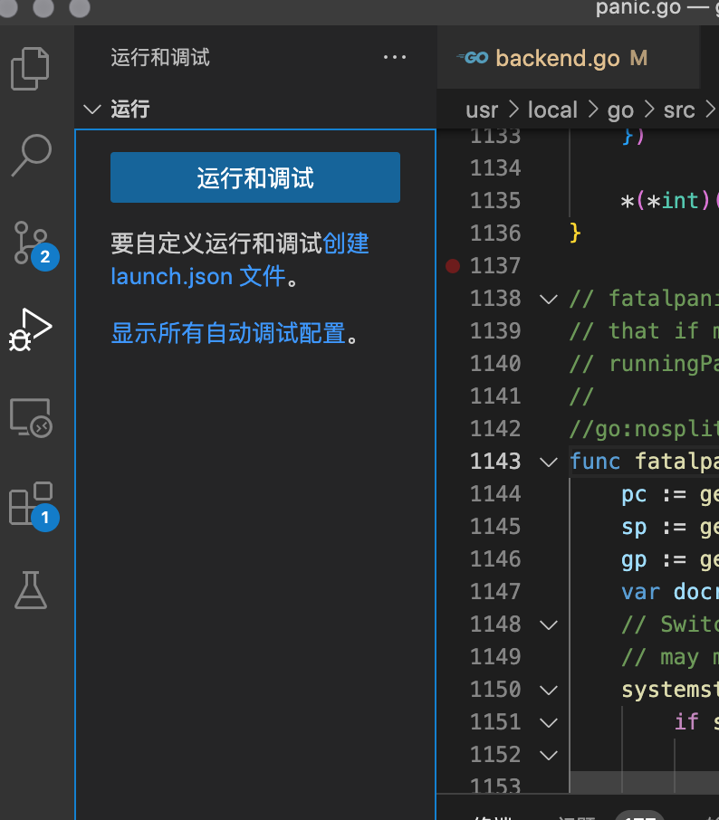
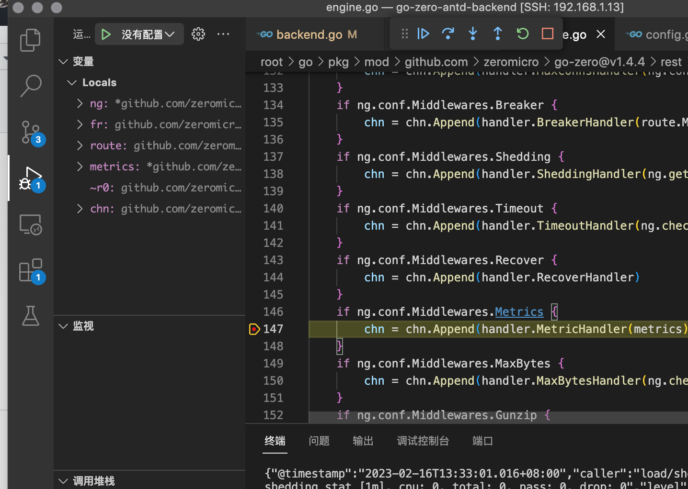

# go-zero-antd实战-2（go-zero学习方法）

## 关闭go-zero log stat

> go-zero自带了很多好用的中间件，但是在开发过程中有一些中间件会不停打印日志，就想着能不能控制自带的中间件是否启动

### 查看分析源码

go-zero/rest/engine.go
```go
func (ng *engine) buildChainWithNativeMiddlewares(fr featuredRoutes, route Route,
	metrics *stat.Metrics) chain.Chain {
	chn := chain.New()

	if ng.conf.Middlewares.Trace {
		chn = chn.Append(handler.TraceHandler(ng.conf.Name,
			route.Path,
			handler.WithTraceIgnorePaths(ng.conf.TraceIgnorePaths)))
	}
	if ng.conf.Middlewares.Log {
		chn = chn.Append(ng.getLogHandler())
	}
	if ng.conf.Middlewares.Prometheus {
		chn = chn.Append(handler.PrometheusHandler(route.Path))
	}
	if ng.conf.Middlewares.MaxConns {
		chn = chn.Append(handler.MaxConnsHandler(ng.conf.MaxConns))
	}
	if ng.conf.Middlewares.Breaker {
		chn = chn.Append(handler.BreakerHandler(route.Method, route.Path, metrics))
	}
	if ng.conf.Middlewares.Shedding {
		chn = chn.Append(handler.SheddingHandler(ng.getShedder(fr.priority), metrics))
	}
	if ng.conf.Middlewares.Timeout {
		chn = chn.Append(handler.TimeoutHandler(ng.checkedTimeout(fr.timeout)))
	}
	if ng.conf.Middlewares.Recover {
		chn = chn.Append(handler.RecoverHandler)
	}
	if ng.conf.Middlewares.Metrics {
		chn = chn.Append(handler.MetricHandler(metrics))
	}
	if ng.conf.Middlewares.MaxBytes {
		chn = chn.Append(handler.MaxBytesHandler(ng.checkedMaxBytes(fr.maxBytes)))
	}
	if ng.conf.Middlewares.Gunzip {
		chn = chn.Append(handler.GunzipHandler)
	}

	return chn
}
```
看到这里就知道我们修改项目etc/backend.yaml
```go
# 控制go-zero提供的中间件是否启用
Middlewares:
  Breaker: false
  Shedding: false
  Metrics: false
```
> 这些关闭了还是打印stat日志

再分析发现需要关闭stat日志,修改backend.go

```go
...
// 日志
logx.DisableStat()

server := rest.MustNewServer(c.RestConf)
defer server.Stop()
...

```
现在控制台再也不会打印stat日志了，但是这种方式不优雅，继续阅读源码发现go-zero/rest/engine.go下加载RestConf
``` go
type engine struct {
    // 这里是配置
	conf                 RestConf
	routes               []featuredRoutes
	unauthorizedCallback handler.UnauthorizedCallback
	unsignedCallback     handler.UnsignedCallback
	chain                chain.Chain
	middlewares          []Middleware
	shedder              load.Shedder
	priorityShedder      load.Shedder
	tlsConfig            *tls.Config
}


// 通过RestConf找到结构体
RestConf struct {
		service.ServiceConf
		Host     string `json:",default=0.0.0.0"`
		Port     int
		CertFile string `json:",optional"`
		KeyFile  string `json:",optional"`
		Verbose  bool   `json:",optional"`
		MaxConns int    `json:",default=10000"`
		MaxBytes int64  `json:",default=1048576"`
		// milliseconds
		Timeout      int64         `json:",default=3000"`
		CpuThreshold int64         `json:",default=900,range=[0:1000]"`
		Signature    SignatureConf `json:",optional"`
		// There are default values for all the items in Middlewares.
		Middlewares MiddlewaresConf
		// TraceIgnorePaths is paths blacklist for trace middleware.
		TraceIgnorePaths []string `json:",optional"`
	}

// 发现嵌入了service.ServiceConf继续跳转
type ServiceConf struct {
	Name       string
	Log        logx.LogConf
	Mode       string `json:",default=pro,options=dev|test|rt|pre|pro"`
	MetricsUrl string `json:",optional"`
	// Deprecated: please use DevServer
	Prometheus prometheus.Config `json:",optional"`
	Telemetry  trace.Config      `json:",optional"`
	DevServer  devserver.Config  `json:",optional"`
}
// 发现了Log        logx.LogConf继续跳转
type LogConf struct {
	ServiceName         string `json:",optional"`
	Mode                string `json:",default=console,options=[console,file,volume]"`
	Encoding            string `json:",default=json,options=[json,plain]"`
	TimeFormat          string `json:",optional"`
	Path                string `json:",default=logs"`
	Level               string `json:",default=info,options=[debug,info,error,severe]"`
	MaxContentLength    uint32 `json:",optional"`
	Compress            bool   `json:",optional"`
	Stat                bool   `json:",default=true"`
	KeepDays            int    `json:",optional"`
	StackCooldownMillis int    `json:",default=100"`
	// MaxBackups represents how many backup log files will be kept. 0 means all files will be kept forever.
	// Only take effect when RotationRuleType is `size`.
	// Even thougth `MaxBackups` sets 0, log files will still be removed
	// if the `KeepDays` limitation is reached.
	MaxBackups int `json:",default=0"`
	// MaxSize represents how much space the writing log file takes up. 0 means no limit. The unit is `MB`.
	// Only take effect when RotationRuleType is `size`
	MaxSize int `json:",default=0"`
	// RotationRuleType represents the type of log rotation rule. Default is `daily`.
	// daily: daily rotation.
	// size: size limited rotation.
	Rotation string `json:",default=daily,options=[daily,size]"`
}


// 最终找到这个参数
// Stat                bool   `json:",default=true"`

// 下一步编辑etc/backend.yaml
Name: Backend
Host: 0.0.0.0
Port: 8888

Log:
  Stat: false

...

```

> 至此我们通过配置文件控制Log的输出，上面说的是使用go-zero的两种查询使用思路

## 通过vscode单步调试go-zero

vscode启动debug


这里可以点击运行和调试或者直接F5运行
> 注意，在断点打好后，一定要打开main.go文件，debug默认是启动当前文件的。如果处于断点文件是不行的。

